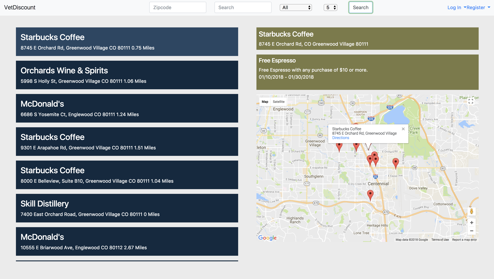
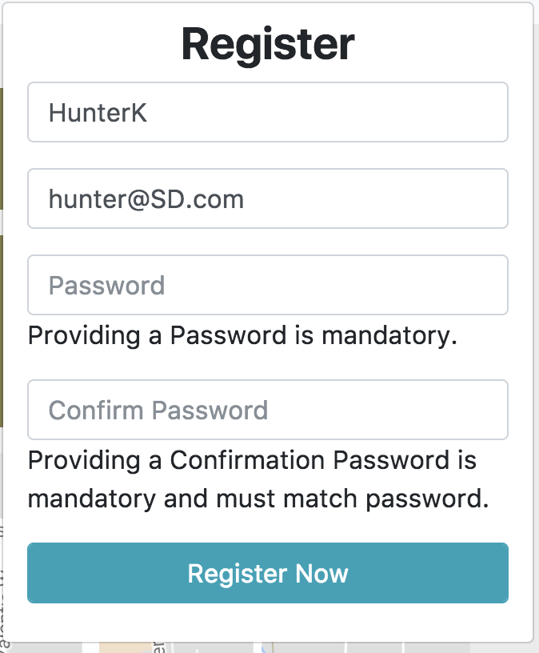
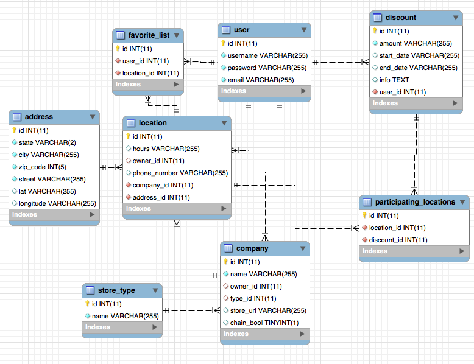

# Veterans Discount API
Final project for Skill Distillery Full-Stack Java Coding Program
Created by Jacob Simms, Aaron Ipp, Hunter Kritisis, Alex Perez !!

The Application

In the past finding military discounts was a long and arduous process. With Vet Discount you can find and share
military discounts in your local area.

Users can:
 - Create an Account
 - Login
 - View Posted Discounts near you
 - Create discounts and businesses that are not listed
 - Edit information you have posted
 - Search through discounts in your area
 - Filter search results to better find what you are looking for

Technologies used:
 - JAVA		
 - SPRING
 - JPA
 - MYSQL
 - ANGULARJS

The home page is the search page.
To do search you do not need an account.
In order to create a new discount please create an account or
use the pre made tester account Username: HunterK Password: password123

By clicking register the user will see a form to create a new account.

Once you login you lead to the main page with three options

Create brings you to the create event page

Attend Event brings you to a page to view all listed events and attend them if you choose

Database Schema

When you click details on an event entry it displays a modal with information about that events and other users
who are attending

